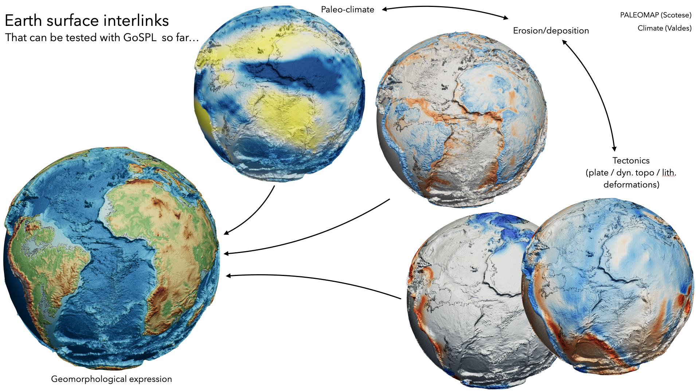

## Data folder

We start with the high-resolution paleo-elevation from Scotese and the associated rainfall map from Valdes et al..

We also use the rotation file and plate boundary polygons from `Gplates` reconstruction. Using `Gplates` we extract the velocity at 0.1 degrees resolution that are extracted as `xy` files containing the `plate IDs`.

Note that plate IDs are then used to generate `goSPL` input file in the next folder.

We also make some corrections of the DEM from Scotese as there are some issues on the edges of the map. This is done with the notebook: `cleanScotese.ipynb` and the new DEMs (netcdf files) are uploaded in the folder `ndem`

## Additional paleo dataset

Paleo-climate (in the form of rainfall), paleo-elevation as well as plate velocities (from Gplates) are required for running `goSPL` model.

An example of such paleo dataset is available from this link:

+ Salles, Tristan (2021): Global dataset. figshare. Dataset. https://doi.org/10.6084/m9.figshare.16968166.v1

+ Scotese, Christopher R, & Wright, Nicky M. (2018). PALEOMAP Paleodigital Elevation Models (PaleoDEMS) for the Phanerozoic [Data set]. Zenodo. https://doi.org/10.5281/zenodo.5460860
