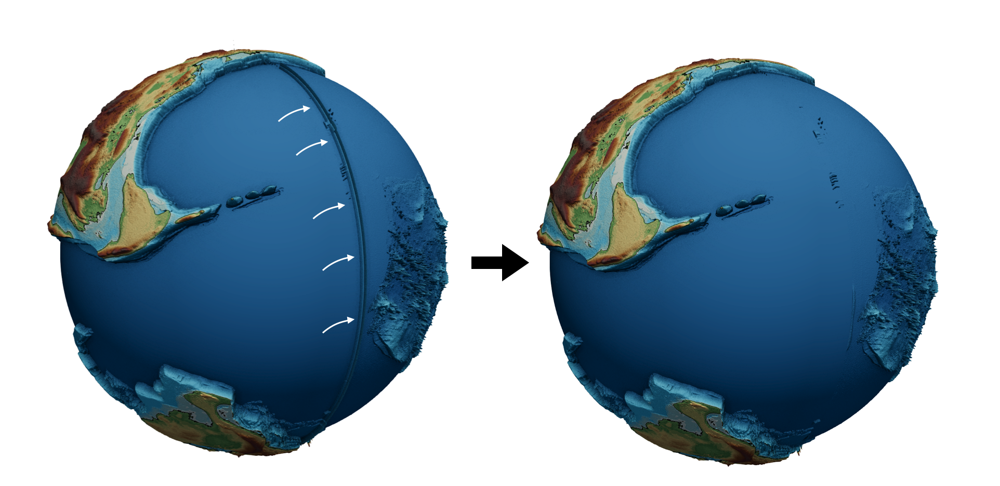

## Additional paleo dataset 

Paleo-climate (in the form of rainfall), paleo-elevation as well as plate velocities (from Gplates) are required for running `goSPL` model.

An example of such paleo dataset is available from this link:

+ Salles, Tristan (2021): Global dataset. figshare. Dataset. https://doi.org/10.6084/m9.figshare.16968166.v1 

+ Scotese, Christopher R, & Wright, Nicky M. (2018). PALEOMAP Paleodigital Elevation Models (PaleoDEMS) for the Phanerozoic [Data set]. Zenodo. https://doi.org/10.5281/zenodo.5460860
