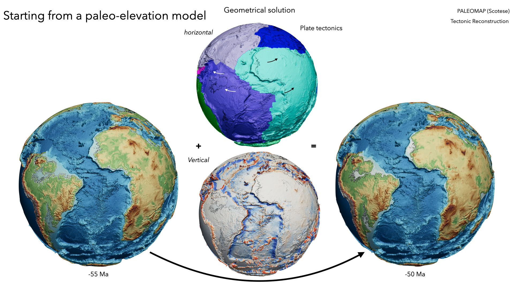

## Extracting paleo-elevation forcings

Before starting to run a `goSPL` model we first have to create a series of input files that will be used during the simulation to better constrain the simulation over time. Specifically we want to get for our `goSPL` mesh the plate tectonic displacements (horizontal plate motion), the rainfall conditions and the vertical component required to move from one time step to the following one.

To get all these informations we will use the `InitialisingEarth` library available from:
+ [here](https://github.com/suoarski/InitialisingEarth.git) in the branch named `package` 
+ to install the library you will need to look at the `README` file in the github repository



Once installed, the library required an input file (an example is provided in this folder: `inputearth5Ma.yml`). All the inputs required to run the `goSPL` global model will be save in a folder defined in the `yml` input under the `gospl:` key. 

There are 4 different types of input files that will be created for `goSPL`:

- `mesh_X_XXMa.npz`: defining the initial elevation mesh used in `goSPL`,
- `rain_X_XXMa.npz`: defining the rainfall for considered period of time for the `goSPL` mesh,
- `plate_X_XXMa.npz`: defining `goSPL` nodes horizontal displacements based on considered plate tectonic model,
- `tecto_X_XXMa.npz`: defining `goSPL` geometric tectonic conditions at given time intervals.


Example of how these files are added to `goSPL` input:

```yaml
domain:
    npdata: '../2-inputgen/gospldata/mesh_9_100Ma'
    
plates:
  - start: -100.e6
    plate: '../2-inputgen/gospldata/plate_9_100Ma'
    upsub: '../2-inputgen/gospldata/tecto_9_100Ma'

climate:
  - start: -100.e6
    map: ['../2-inputgen/gospldata/rain_9_100Ma','r']
```


#### Important

By default `InitialisingEarth` will export in the `tecto_X_XXMa.npz` file the uplift/subsidence with the key `t` **and** the corresponding paleo-elevation from the model (here Scotese) with the key `z`. 

+ In cases where you want to run a `goSPL` model constrained with the Scotese paleo-elevation (meaning that every 5 Ma the `goSPL` elevation is forced to match with Scotese one) you do not have to change anything.

+ However generally, we do not want to have such constrained in our model and would rather try to incrementally change the uplift/subsidence forcing based on the computed erosion/deposition. In such cases, you will have to remove the `z` key from the file. This is done in the cell below:
